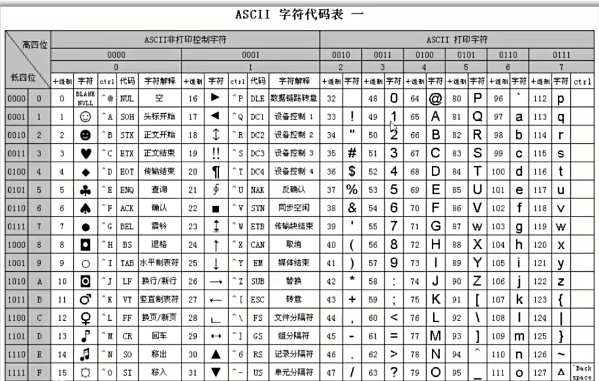
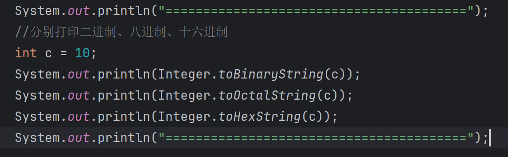
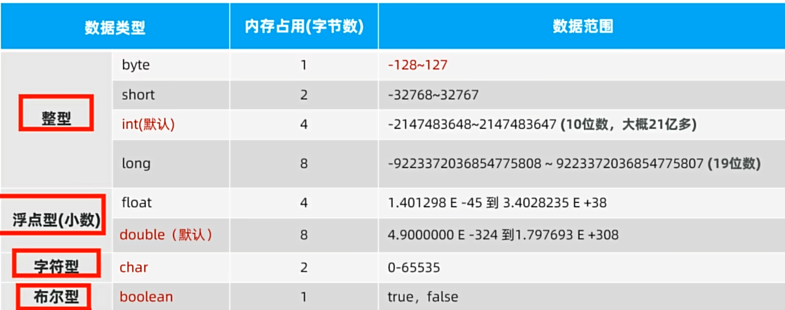
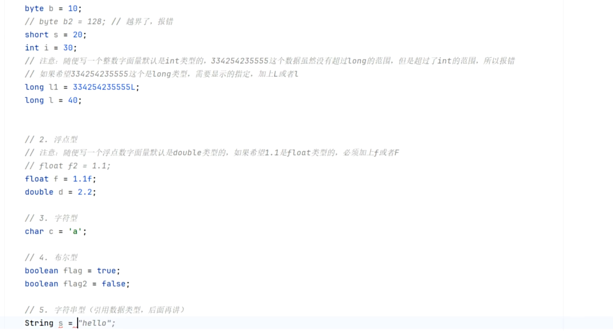
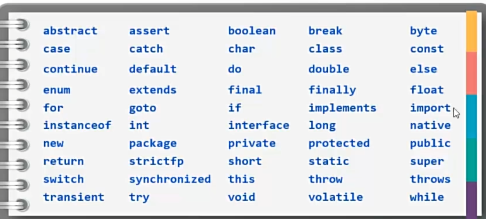
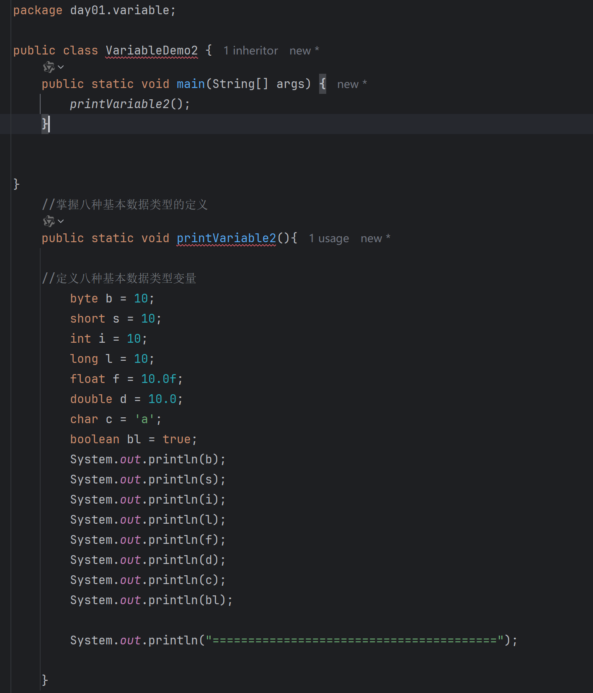
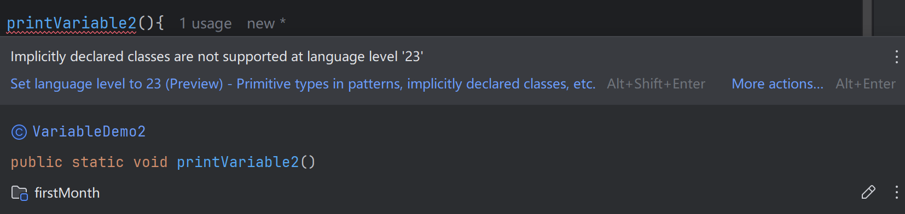

# 第一天学习 笔记

1. 方法是最小功能单位

### java基础语法

1. #### 注释

- 单行注释
- 

- 多行注释
- 

- 文档注释
- 

2. **字面量**

- 数据的书写格式
- 

- 

- 

- 

3. #### 变量详解

- 变量是用来存储数据的
- 定义格式 **数据类型 变量名称 = 数据；** ``` int age = 18;```
- 

- 可维护性强 灵活性强

4. #### **数据的存储原理**

- 字符 是通过 ASCII表 存储 对应**数字的二进制**
- 

- 图片存储 无数个像素点组成 每个像素点的数据 用 0~255x255x255 的形式表示
- 声音存储 通过波形图定义 坐标轴 为二进制 来存储

#### 5.**进制**

- 二进制 除二取余法  位次法快速转换拼凑
- 八进制 三位一组 切割转换  二转八
- 16进制 四位一组 切割转换 二转十六 
- 


- 

#### 6.数据类型

- 基本数据类型（四大类八种）
  - 整形
    - byte 1字节 -128-127
    - short 2字节 
    - int 4字节 
    - long 8 字节
  - 浮点型（小数）
    - float 4字节
    - double 8 字节
  - 字符型  char 2字节
  - 布尔型 boolean 1字节
- 
- 引用数据类型
  - String 字符串 用来定义字符串
- 

#### 7.关键字与标识符

- 
- 关键字不能为 变量名（标识符）
- 标识符不能数字开头 
- 不能包含特殊字符
- 变量名首字母建议小写 满足驼峰 className
- 类名建议首字母大写 满足驼峰  ClassName

## END （问题）

1. 

​	

已经解决 因为方法声明 没在 class 中 声明 {}有问题

-----------------------------------------------------------------------------

