## 第二天学习 笔记

1. ### 方法定义

- 特定任务或者操作的代码块
- 接受特定数据 处理完后 返回数据

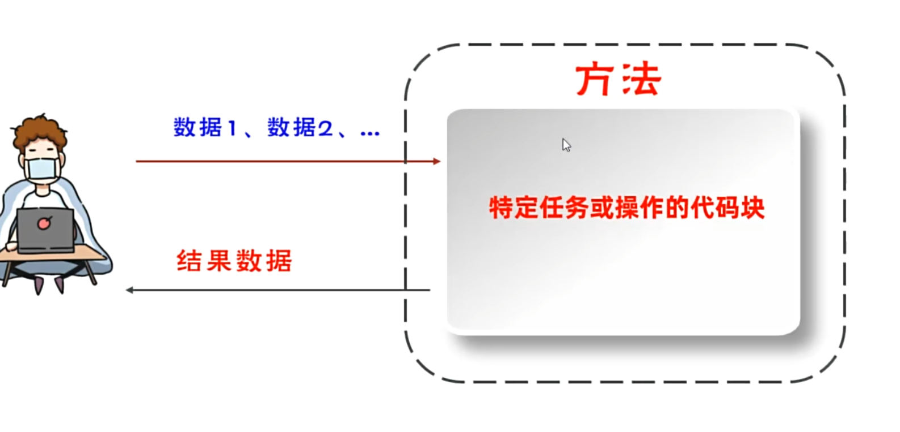

- 方法完整格式

- 方法必须被调用才能执行 调用格式 **方法名称(数据)；**

- 方法的其他形式：
  - 无参数、无返回值类型：void 无返回值
- **其他注意事项**
  - 方法可以重载：一个类中出现多个方法名相同，但是他们的形参列表是不同的，那么这些方法就称为方法重载了。

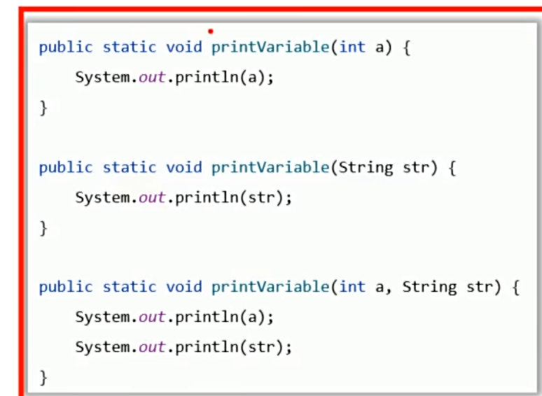

- 重载只关注方法名称相同 形参列表不同 如 类型不同 个数不同 与 顺序不同
- return;作用  提前终止无返回值方法的执行（提前结束方法）**卫语言风格**

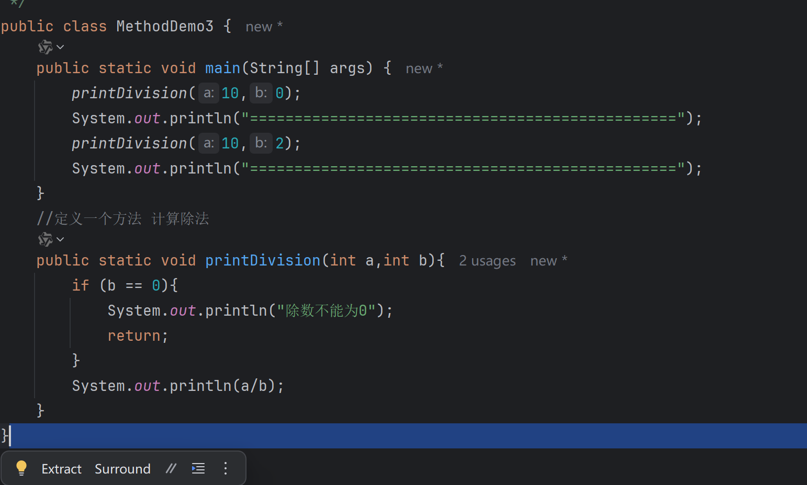

-----------------------------------

2. ### 类型转换

- 自动类型转换
  - 类型范围小的变量可以直接赋值给类型范围大得变量

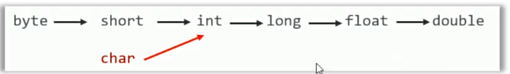

- 强制类型转换
  - 转换语法： 目标类型 新变量 = （目标类型）原变量 或者调用时 方法名称（（目标类型）变量x）

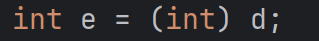

- 表达式的自动类型提升
  - 在表达式中 小范围变量会自动转换成表达式中的较大范围的类型 再参与运算

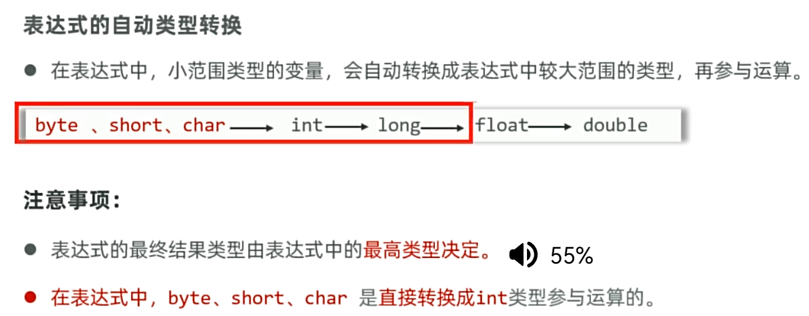

-  表达式的最终类型是由最高类型决定的

-----------------------------------------------------------

3. ### 输入输出

- 应用程序编程接口（API）

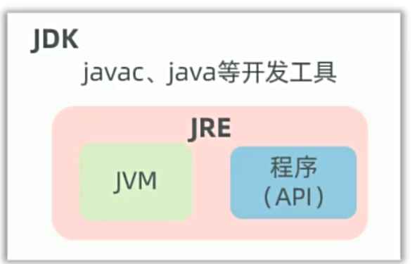

--------------------------------------------------------------

4. ### 基本的运算符

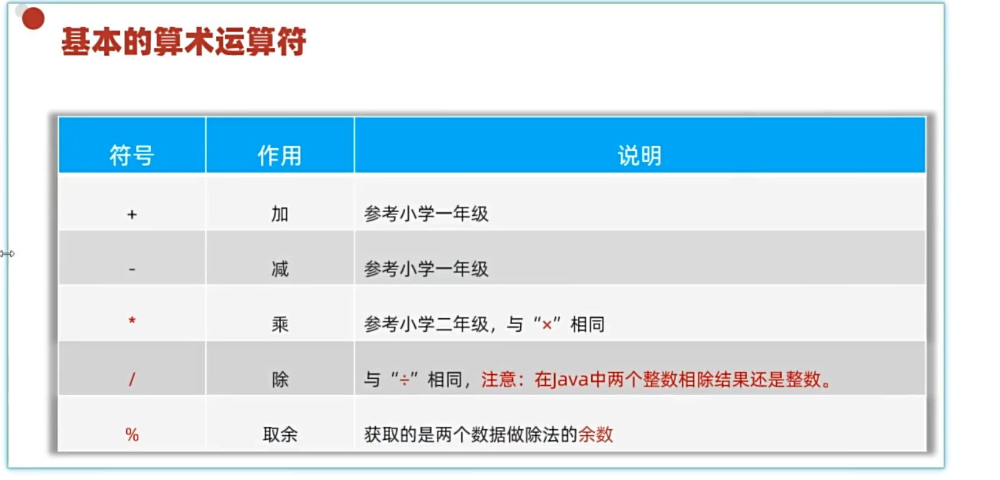

- “+”符号在JAVA中的特殊用途 
  - 有些时候可以做连字符
  - 它与字符串运算的时候是用作连接符，其结果依然是个字符串
  - 能算则算 不能算则连

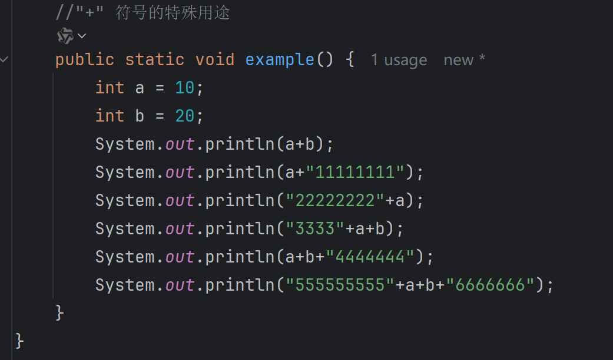

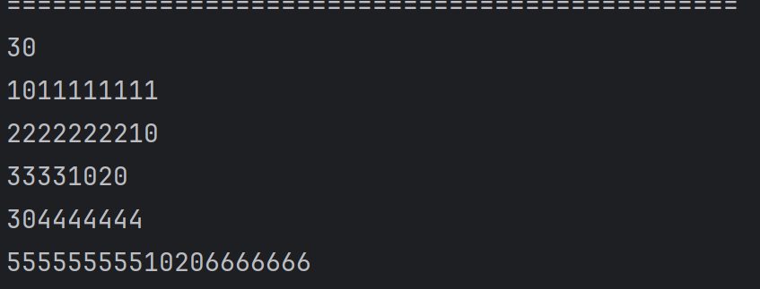

- 尤其注意倒数第二条结果 计算从左往右计算 数字相遇时为加法 遭遇字符串为拼接

---------------------------------------------------

5. ### 自增自减运算符

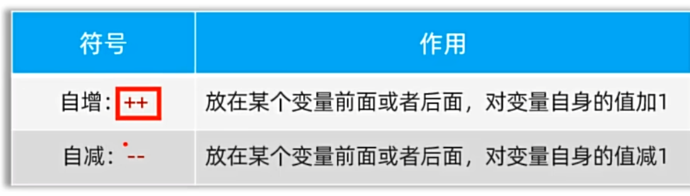

- 注：只能操作变量 不能操作字面量
- "++" "--" 在变量前后单独使用是没有区别的
- "++" "--"  在前为在使用前变更 在后为使用后变更

-------------------------------------

6. ### 赋值运算符

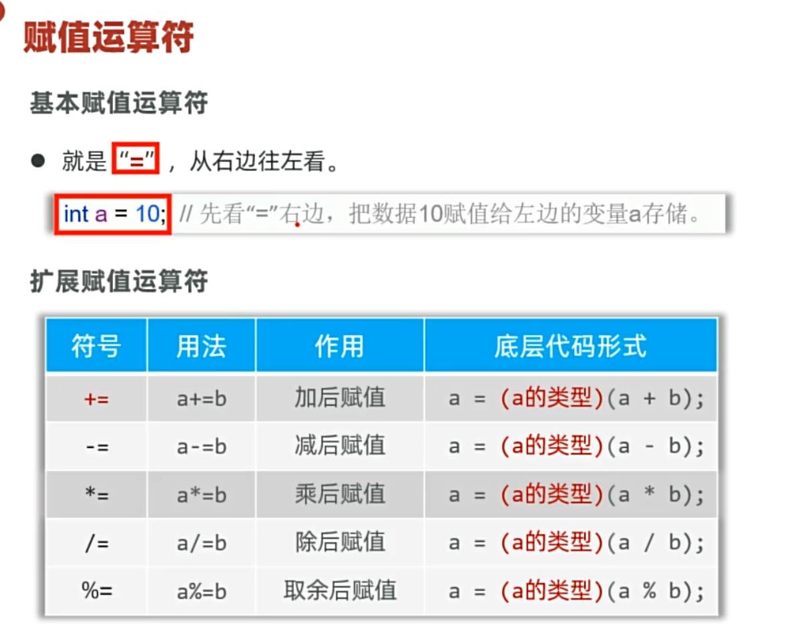

-  **xx后赋值**     
- 扩展赋值运算符隐含了强制类型转换 

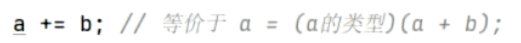

--------------------------------------

7. ### 关系运算符、三元运算符

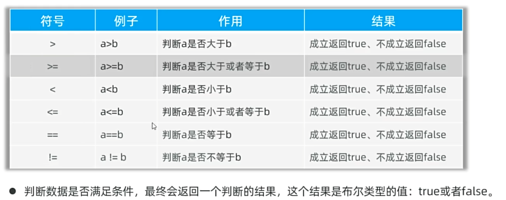

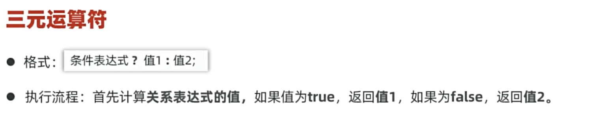

-----------------

8. ### 逻辑运算符

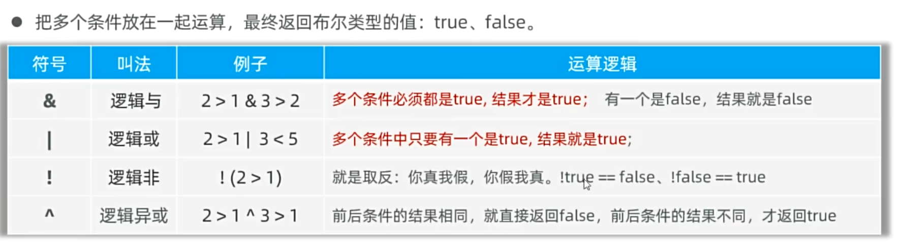

- & 必须多个条件都为true,其他都为false
- | 只要有一个为真 结果为true
- ！ 取反
- ^ 不同为真 相同为假

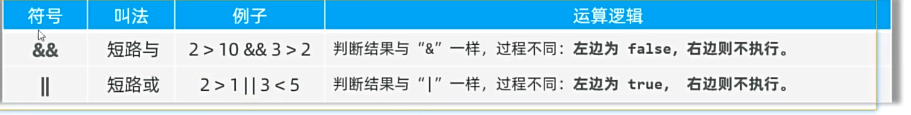

- && 只要前边为假 不再做多余计算直接结束 返回 false
- || 只要前边为真 不再做多余计算直接结束 返回 true

-------------------

### 综合案例

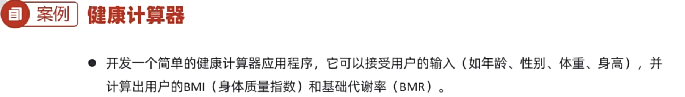

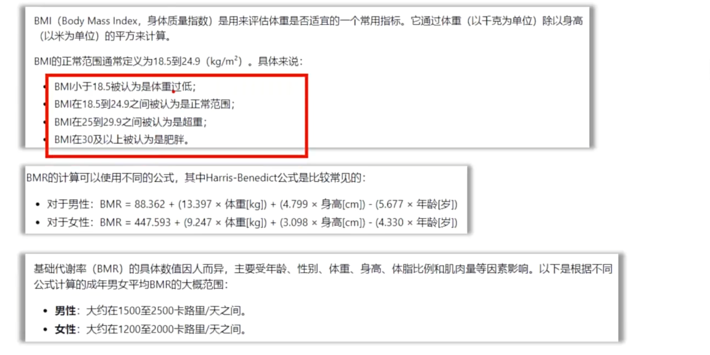