# day05学习笔记

### 1. 对象的定义

对象是一种特殊的数据结构，可以记住一个事务的数据，从而代表该事务

### 2.面向对象编程快速入门

- 先设计对象模板，也就是对象的设计图：类
- 通过new关键字 ，每new 一次类 就的得到一个新的对象

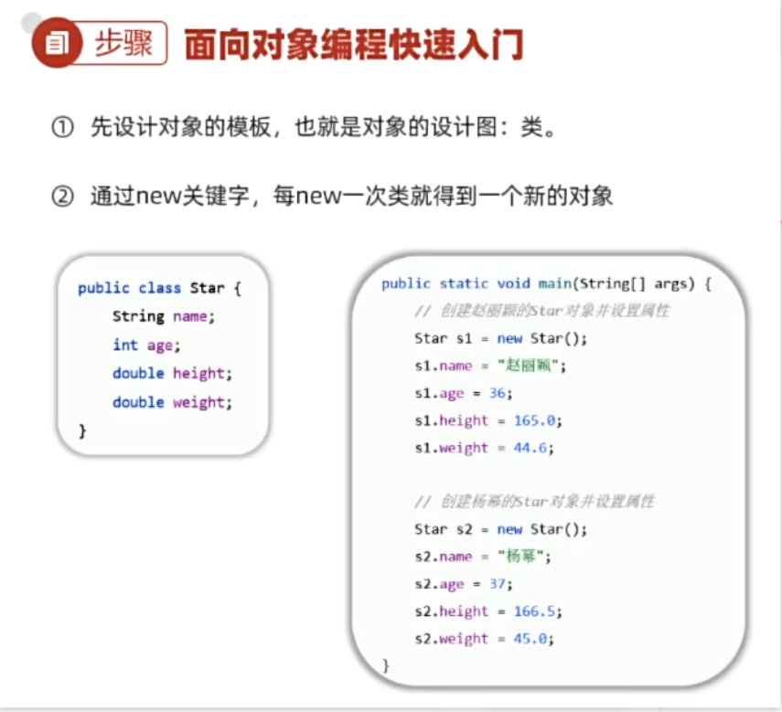

- 创建对象格式 类名 对象名 = new 类名（）

 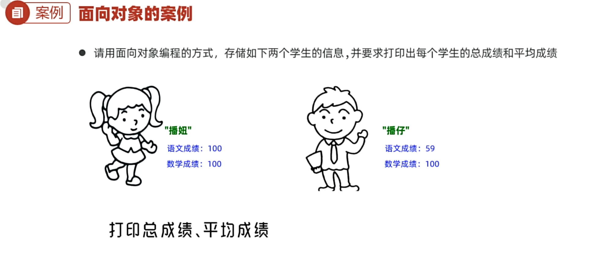

- 封装：把数据和对数据的处理放到同一个类中去

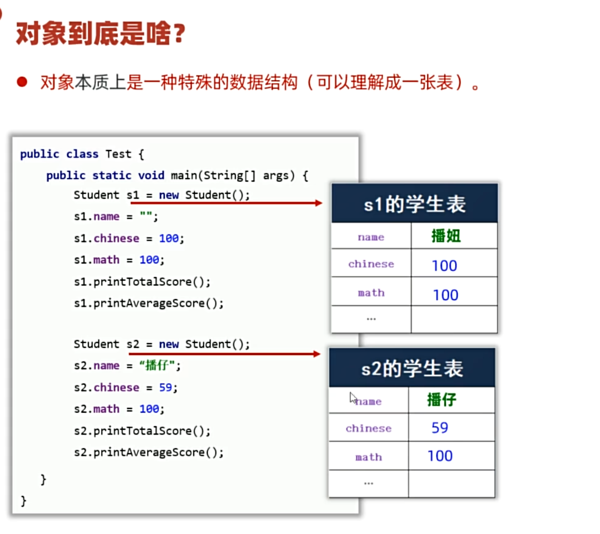

- 变量存在栈内存里，变量指向对象，对象存在堆内存里，对象含有类的地址，类存在方法区里，将方法区中的类调到栈中执行

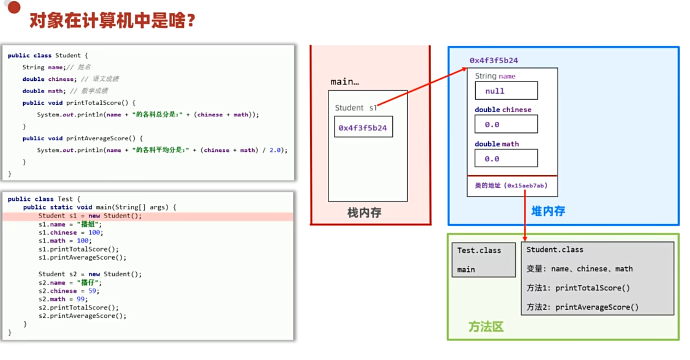

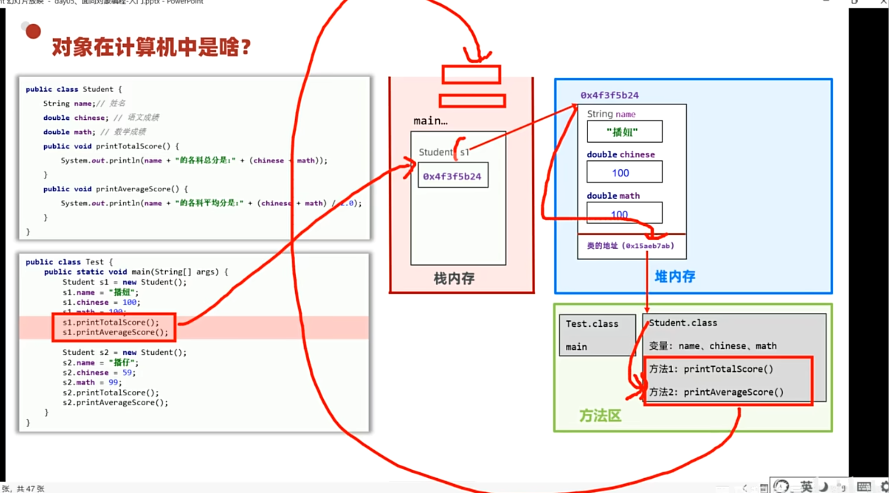

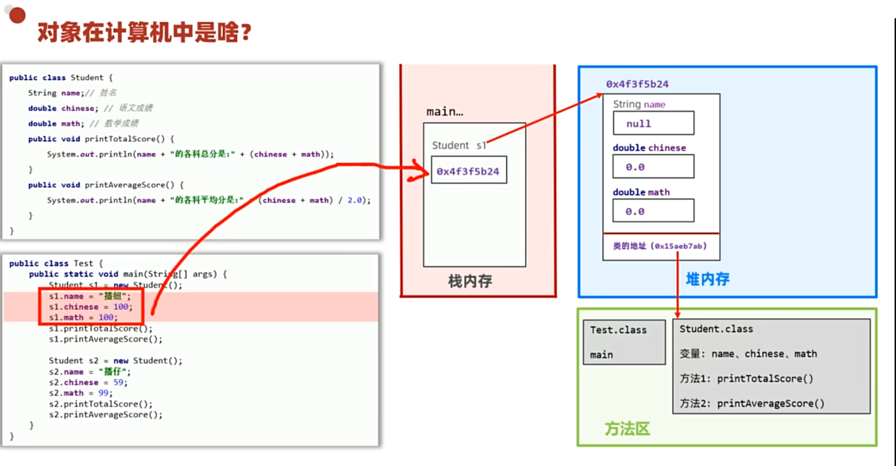

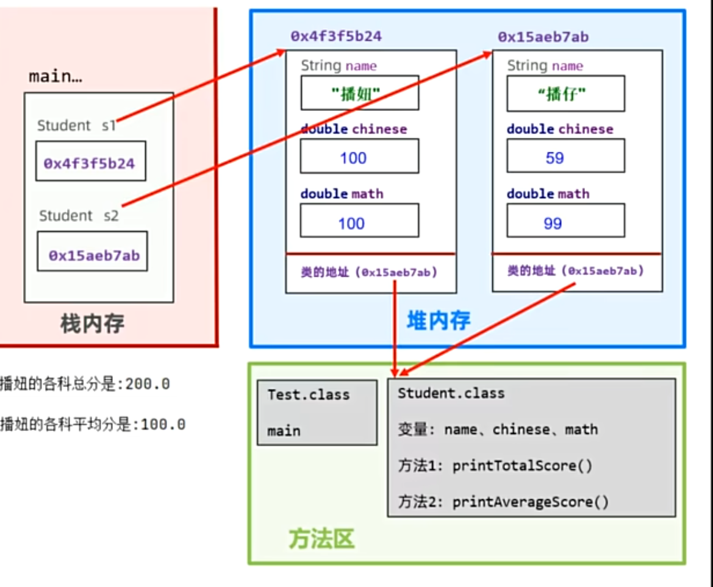

- 万物皆对象,谁的数据谁存储 

3. ### 类的基本语法

- #### 构造器

1. 构造器: 是一种特殊方法,不能写返回值类型,名称必须是类名,就是构造器.
2. 特点:创建对象时,对象会去调用构造器
3. 构造器的常见应用场景 : 创建对象时,同时完成对对象成员变量(属性值的初始化赋值)

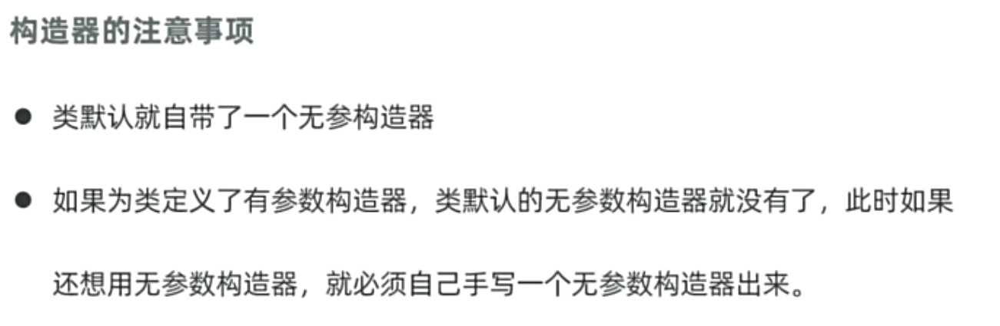

- #### this

1. this 就是一个变量 , 可以用在方法中,来拿到当前对象
2. 应用场景 ;  变量名冲突的问题

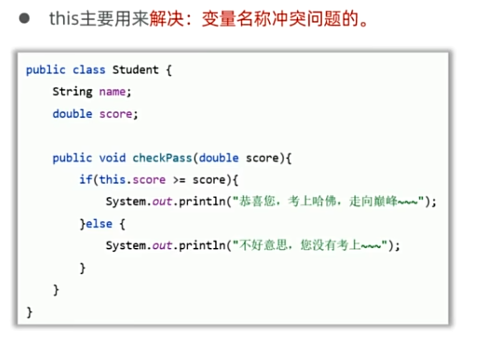

- #### 封装

1. 面向对象的三大特征之一: 封装 继承 多态
2. 类就是一种封装
3. 封装的设计要求: 合理隐藏,合理暴露  成员变量私有化 使用公开的get set 方法 来取值与赋值 

- #### javabean (实体类)

1. 是一种特殊类,类中满足如下要求
   - 类中成员变量全部私有,并提供public修饰的getter/setter方法
   - 类中需要提供一个无参数构造器,有参数构造器可选
2. 实体类的基本作用: 创建它的对象, 存取数据(封装数据)
3. 实体类在开发中的应用场景: 
   - 实体类的对象只负责数据的存取,而对数据的业务员处理交给其他类的对象来完成,以实现数据和数据业务处理相分离

- #### static

1. static 名为静态 可以修饰成员变量成员方法
2. 成员变量有无static 分为两种
   - 静态变量(类变量)
     - 有static修饰 属于类 在计算机里只有一份,会被类的全部对象共享
   - 实例变量(对象的变量)
     - 无static修饰 属于每个对象的
3. 成员变量的变化过程

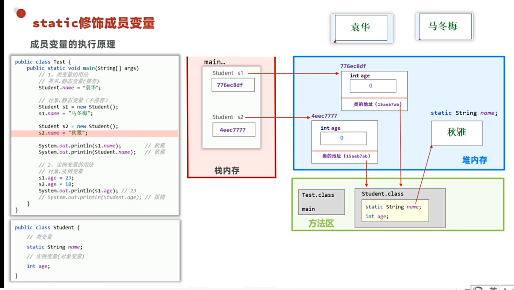

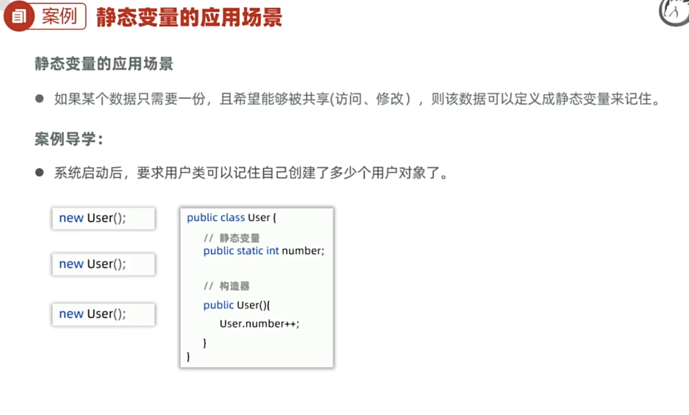

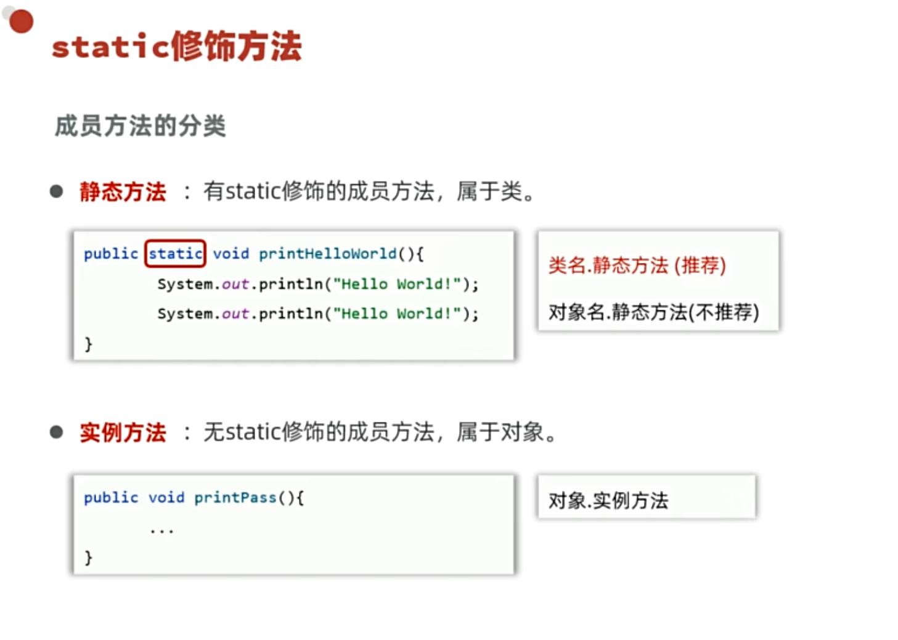

 

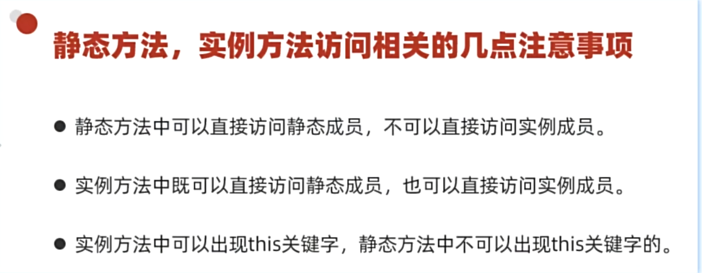

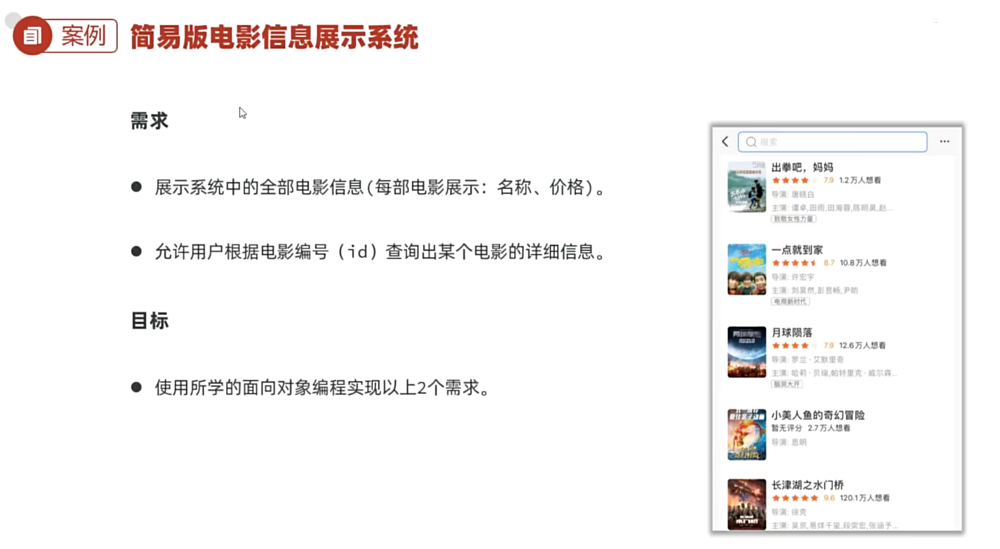