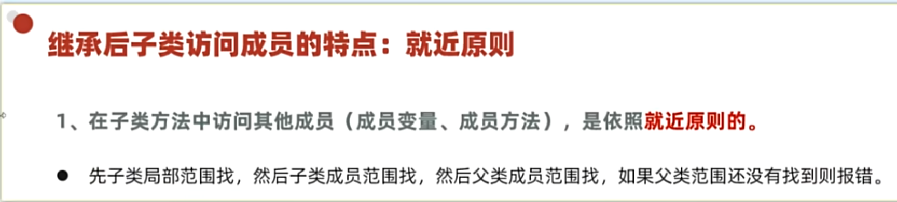
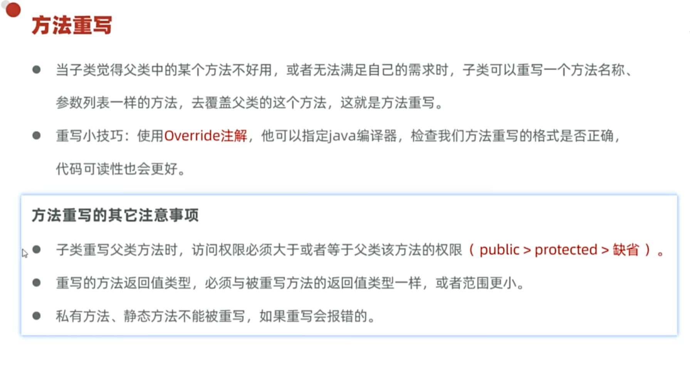
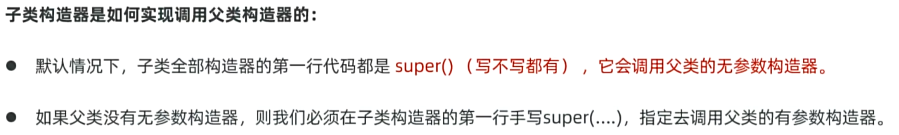
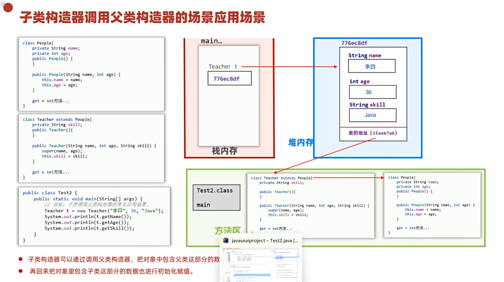
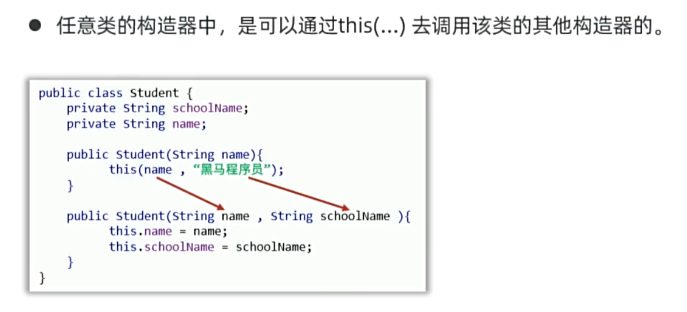
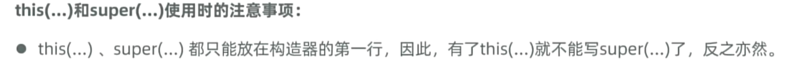
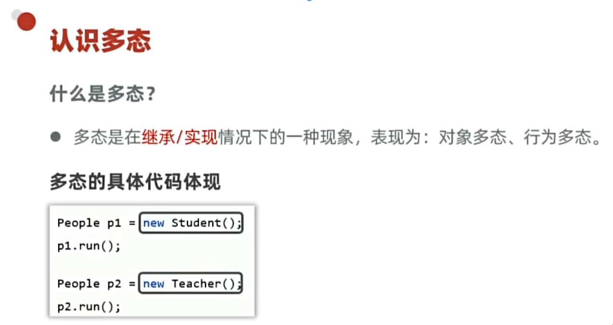
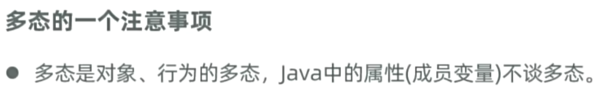
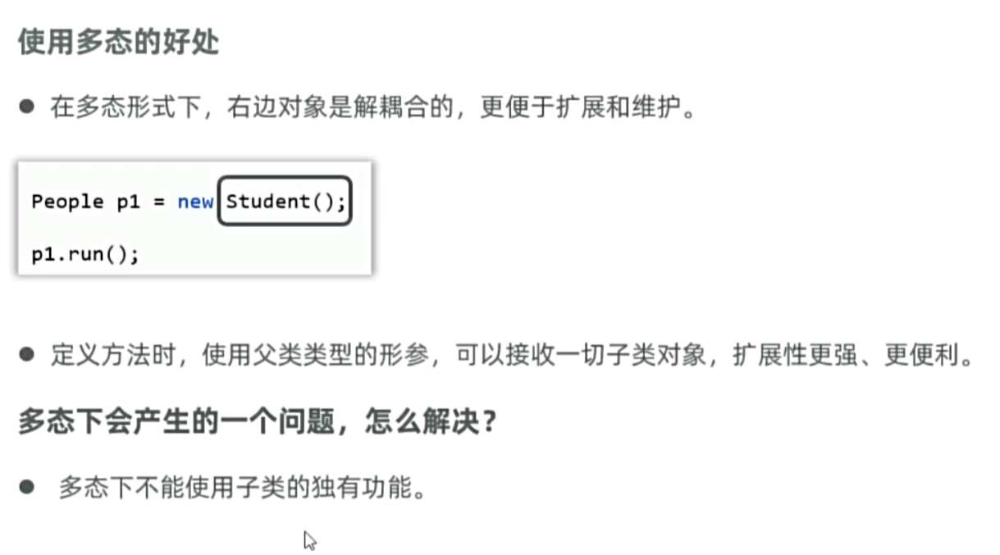

# day06学习笔记

1. ## 继承

- ### 权限修饰符

- ### 继承的特点

- 一个类要么默认继承 Object 要么间接 继承  要么默认继承

- ### 方法重写

- 重写注解 @Override 会检查重写的正确性 可读性也更好

- 重写规范 ：声明不变，重新实现

- 重写应用场景 ：当子类觉得父类方法不好用，或者不满足自己的需求时，就可以用方法重写

- #### 案例

  子类重写toString  输出对象信息 而不是 对象的'地址'

- ### 子类构造器的特点

- 子类的全部构造器，都会先调用父类的构造器，再执行自己。

- #### 子类调用父类构造器的应用场景

 

- #### 补充知识：this(...)调用兄弟构造器

2. ### 多态

 

- #### 多态的好处

- #### 多态的类型转换 

3. ### 综合案例

