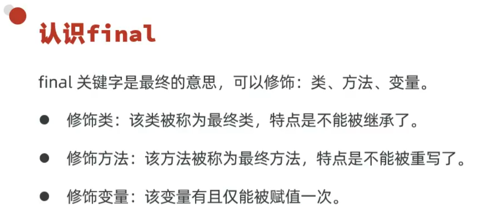
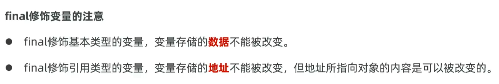
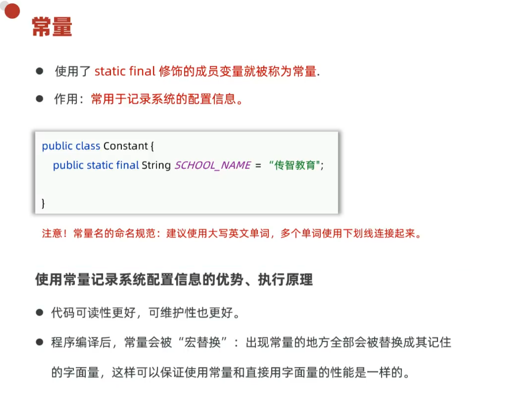
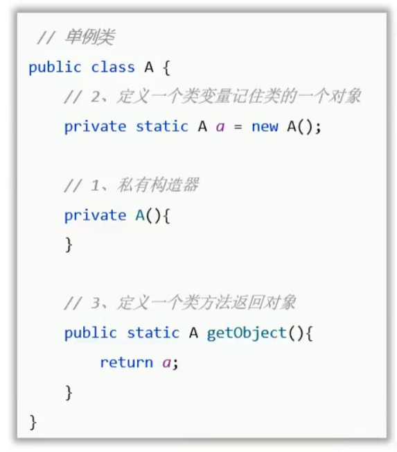
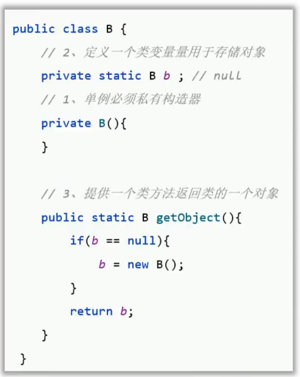
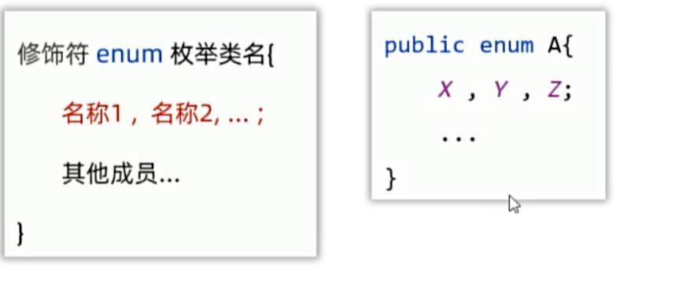
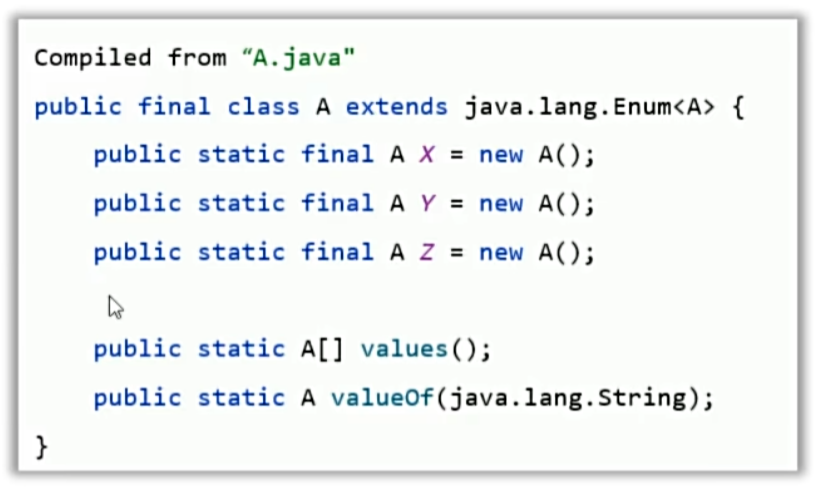

# day07 学习笔记

1. ### final 关键字 

2. ### 单例类(设计模式)

- **什么是 设计模式？** 

  - 一个问题常有n种解法，其中肯定是有一种解法是最优的，这个最优的解法被人总结出来了，称之为**设计模式**

  - 设计模式有20多种，对应20多种软件开发中会遇到的问题

- **关于设计模式主要学会什么**
  - **解决什么问题?**
  - **怎么写？**

- **单例设计模式**
  - **作用**：确保某个类只能创建一个对象
    - 例：电脑的任务管理器只能打开一个
  - **写法实现步骤**
    - 把类的构造器私有
    - 定义一个类变量记住一个对象
    - 定义一个类方法 返回对象

- 如图为 饿汉式单例：拿对象时，对象早创建好了
- 还有懒汉单例： 拿对象时，才开始创建对象

3. ### 枚举类

- 枚举类是一种特殊类
- 枚举的写法

- #### **特点**

  - 枚举类中的第一行，只能写枚举类的对向名称，且要用逗号隔开
  - 这些名词，本质是常量，每个常量记住了一个枚举类对象

- 反编译的结果

- 枚举类都是最终类，不可被继承，枚举类都是继承java.lang.Enum类的
- 枚举类的构造器都是私有的(写不写都只能是私有的)，因此，枚举类对外不能创建对象
- 编译器为枚举类新增了几个方法

- #### 枚举类的常见应用场景

- 枚举类很合适做信息分类和标志

4. ### 抽象类