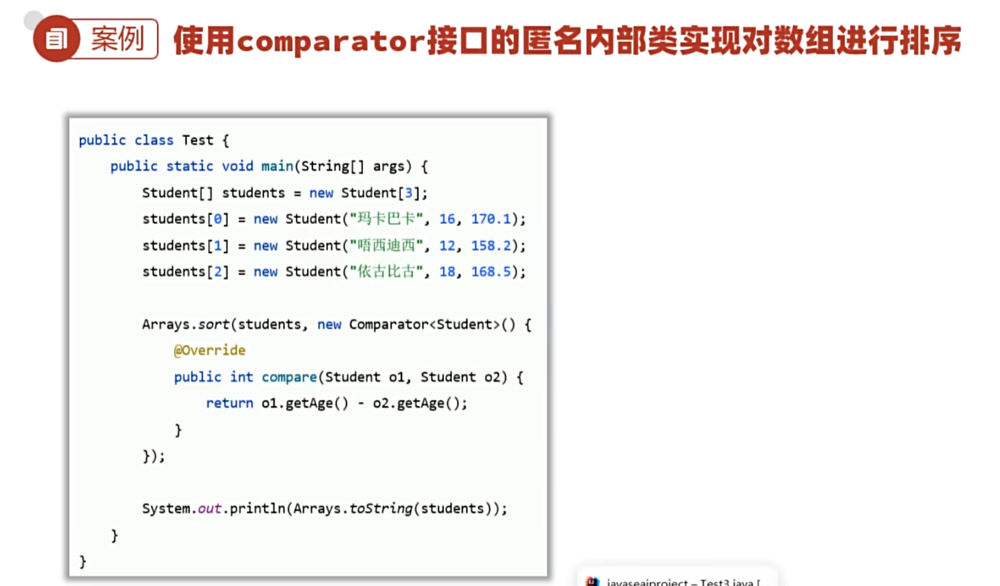
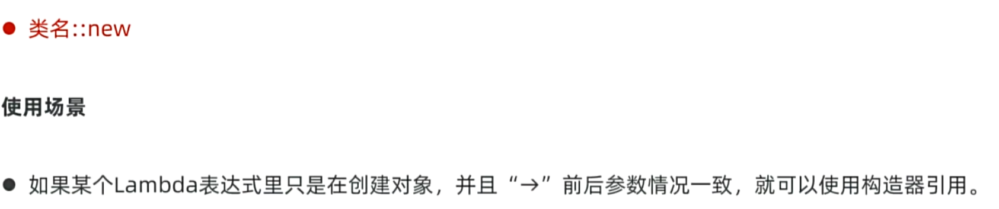
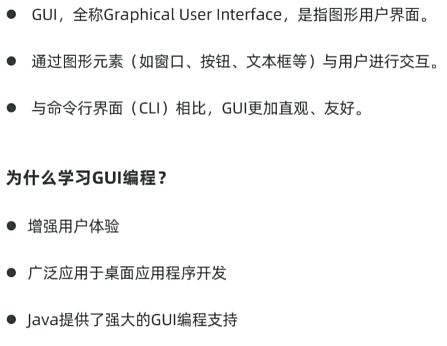

# day08 学习笔记

- ### 代码块

- 代码块是类的5大成分之一（成员变量、构造器、方法、代码块、内部类）

- ### 内部类

- 如果一个类定义在另一个类的内部，这个类就是内部类
- 场景： 当一个类的内部，包含了一个完整的事务，且这个事物没有单独设计的必要，就可以吧这个事物设计成内部类

- #### 成员内部类

  - 就是类中的一个普通成员，类似于普通的成员变量、成员方法
  - 无static 修饰 ，属于外部类对象持有。
  - 会自带无参构造器

- #### 静态内部类

- 有static 修饰的 内部类 属于外部类自己持有

- #### 局部内部类

- 局部内部类是定义在方法中、代码块中、构造器等执行体中。

- #### 匿名内部类

- ##### 认识

- 是一种特殊的局部内部类

- 所谓匿名：指的是程序员不需要为这个类声名名字，默认有个隐藏名字。

- 特点：匿名内部类本周是一个子类，并会立即创建出一个子类对象
- 作用：用于更方便的创建一个子类对象
- 父类为抽象类 创建对象时需要重写方法 类似于子类对象 即为匿名内部类

- ##### 常见使用形式

- 通常作为一个对象参数传输给方法

- ##### 应用场景

- 调用别人提供的方法实现需求时，这个方法正好可以让我们传输一个匿名内部类对象给其使用

- ##### 另一个应用场景

- ### 函数式编程

- 此 “函数” 类似于数学中的函数（强调做什么），只要输入的数据一致，返回的结果也是一致的。

- **解决的问题**：使用Lambda函数带某些匿名内部类对象，从而让程序代码更简洁，可读性更好

- #### Lambda表达式

- JDK8 开始新增的一种语法形式，它表示函数。
- 可以 **用于替代某些匿名内部类对象，从而让程序更简洁，可读性更好**

- 只适用于函数式接口 即 只有一个抽象方法的接口
- 在接口上加上@FunctionalInterface注解即可

- #### 实战示例、省略规则

- #### 方法应用

- ##### 静态方法引用

- ##### 实例方法引用

- ##### 特定类型方法的引用

 

- ##### 构造器引用

- ### 常用API

- #### String

 

- ##### 案例：开发验证码

- ### ArrayList

- 集合是一种容器，是用来装数据的，类似于数组。 

- 数组定义完成后 长度就固定了

- 集合大小可变，功能丰富，开发中使用更多

- ### GUI编程

- #### 常见的布局管理器

- ### 案例

- 通过AI生成想要的GUI界面

