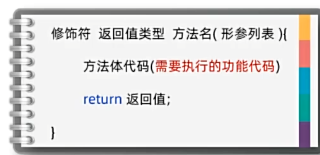
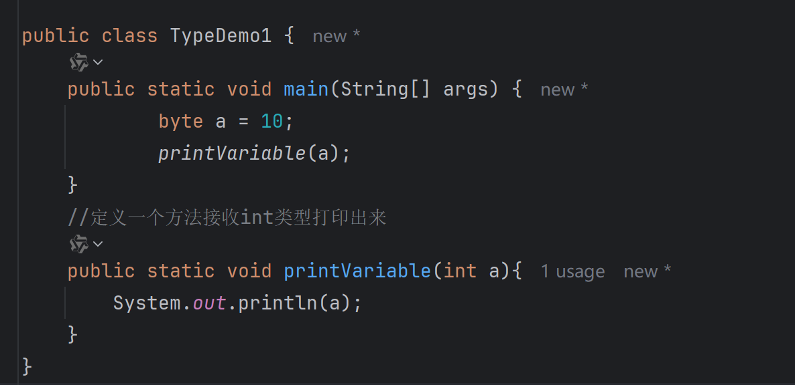

## 第二天学习 笔记

1. ### 方法定义

- 特定任务或者操作的代码块
- 接受特定数据 处理完后 返回数据

- 方法完整格式

- 方法必须被调用才能执行 调用格式 **方法名称(数据)；**

- 方法的其他形式：
  - 无参数、无返回值类型：void 无返回值
- **其他注意事项**
  - 方法可以重载：一个类中出现多个方法名相同，但是他们的形参列表是不同的，那么这些方法就称为方法重载了。

- 重载只关注方法名称相同 形参列表不同 如 类型不同 个数不同 与 顺序不同
- return;作用  提前终止无返回值方法的执行（提前结束方法）**卫语言风格**

2. ### 类型转换

- 自动类型转换
  - 类型范围小的变量可以直接赋值给类型范围大得变量

- 强制类型转换
  - 转换语法： 目标类型 新变量 = （目标类型）原变量
  - 或者调用时 方法名称（（目标类型）变量x）