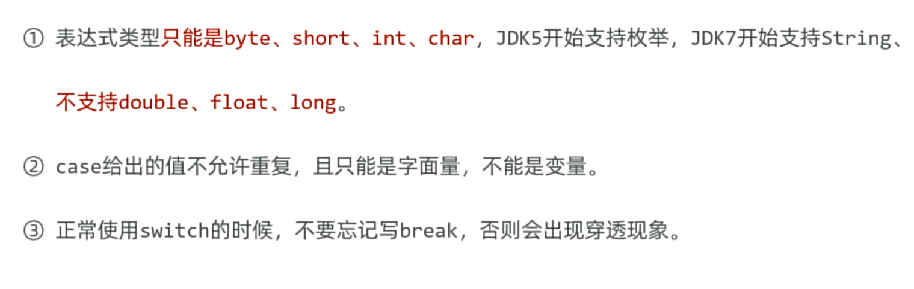

# day3 笔记 程序流程控制

1. ### 程序的三种执行顺序

2. ### 分支结构	

- #### if分支结构

  - 根据条件的真或假，来决定执行某行代码
  - 不同写法

- #### Switch分支结构

- 是通过比较值是否相等，来决定执行哪条分支

 

- #### 讨论 if 与switch 的各自应用场景

- if 在功能上远远大于switch

- 当前条件为区间的时候，建议使用if 分支结构来实现

- 当条件为 一个一个的值比较的时候，建议使用Switch更合适（格式良好、性能较好、代码优雅）

- #### Switch的几点注意事项，穿透性的应用

3. ### 循环结构

- 减少代码的重复、灵活的控制程序的执行

- #### for循环

- #### while循环

- for 和 while 的选择方式
  - 功能上是完全一样的，反之亦然
  - 使用规范 ： 知道循环次数 使用 for   不知道循环次数使用 while

- #### do while循环

- do-while特点 先执行后判断

- #### 死循环

- 如果不干预一直执行下去

- 使用场景 : 服务器程序

- #### 循环嵌套

- 即循环中包含循环

- #### break continue

4. ### 练习案例

- 关于生成随机数的内置方法一

- 关于生成随机数的内置方法二

 